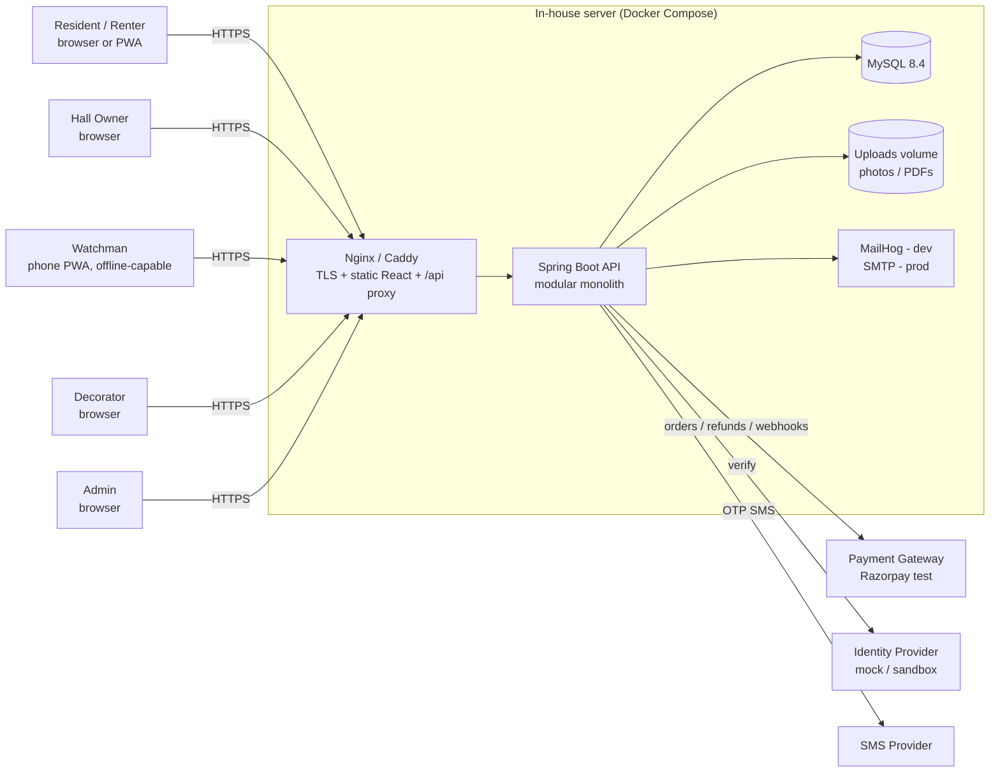
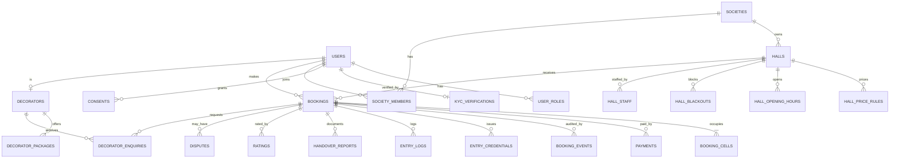
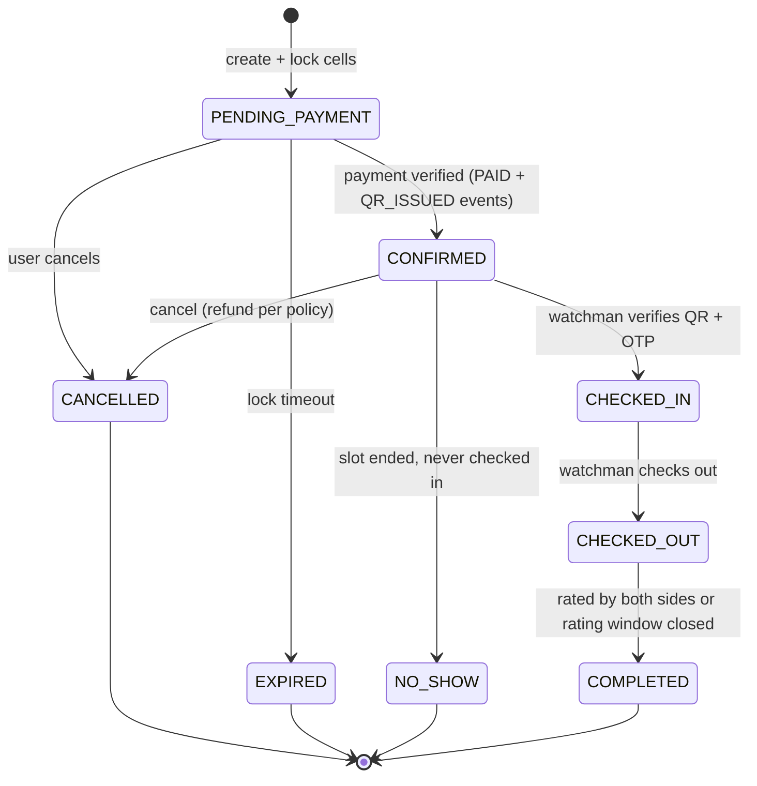
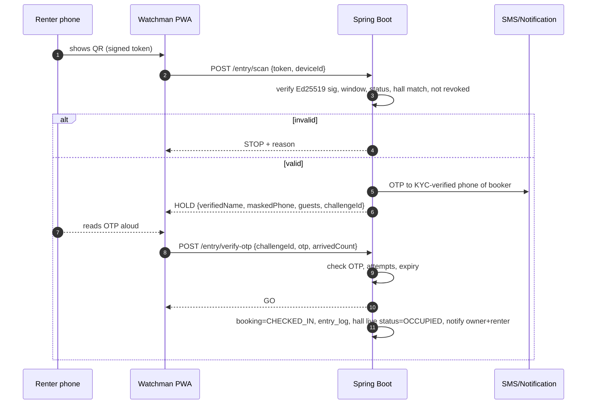

# Architecture

> **Architecture = HOW.** Product intent lives in `PRD.md`. Exhaustive build detail (DDL, API contract, algorithms) lives in `IMPLEMENTATION.md`.
> These decisions are **fixed**. Do not swap the stack or add frameworks without recording the reason in `docs/DECISIONS.md`.

## 1. Technology Stack (fixed)

| Layer | Choice | Notes |
|-------|--------|-------|
| Frontend | **React 18 + TypeScript + Vite** | SPA + installable PWA (`vite-plugin-pwa`) |
| Styling | **Tailwind CSS 3.4** + small in-house component library | Tokens defined in `DESIGN.md` |
| Frontend libs | React Router 6, TanStack Query, React Hook Form + Zod, react-i18next, Leaflet + OpenStreetMap tiles, `html5-qrcode` (scanner), `qrcode.react` (QR display), `idb` (IndexedDB), `@noble/curves` (Ed25519 verify), Recharts (charts), lucide-react (icons) |
| Backend | **Spring Boot 3.x (Java 21)** | REST, layered, stateless |
| Backend libs | Spring Web, Spring Security, Spring Data JPA (Hibernate), Validation, Flyway, jjwt, ZXing (QR PNG), Bucket4j (rate limiting), Spring Mail, springdoc-openapi, Micrometer, Lombok, MapStruct, OpenPDF (report PDF) |
| Database | **MySQL 8.4** | InnoDB, utf8mb4, Flyway migrations |
| Payments | Razorpay **test mode** behind a `PaymentGateway` interface (`MockGateway` for dev/tests) |
| Identity | `IdentityProvider` interface; `MockIdentityProvider` (dev), real providers pluggable later |
| SMS / Email | `SmsProvider` (Console in dev, pluggable), SMTP email (MailHog in dev) |
| Testing | JUnit 5, Mockito, **Testcontainers (MySQL)**, Vitest + React Testing Library, **Playwright** (E2E) |
| DevOps | **Docker Compose**, Nginx (or Caddy) reverse proxy, GitHub Actions CI |
| Category | Facilities Management |

## 2. System Context



**Style: modular monolith.** One deployable Spring Boot app, strictly separated modules. No microservices, no message broker in v1 (an **outbox table** + scheduler covers async needs).

## 3. Backend Architecture

### 3.1 Package layout (package-by-feature, layered inside each feature)

```
backend/src/main/java/com/smartspace/
├── SmartSpaceApplication.java
├── common/            # ApiError, exceptions, Clock, IdGenerator, paging, validation, crypto util
├── config/            # SecurityConfig, CorsConfig, JacksonConfig, SchedulingConfig, OpenApiConfig
├── security/          # JwtService, JwtAuthFilter, CurrentUser, RoleGuard, RateLimitFilter
├── auth/              # register/login/refresh/logout, OTP verification
├── user/              # profile, language, privacy (consents, export, delete)
├── kyc/               # IdentityProvider port, MockIdentityProvider, KycService
├── society/           # societies, members, staff (hall_staff)
├── hall/              # halls, photos, price rules, opening hours, blackouts
├── discovery/         # search, nearest, alternatives
├── availability/      # slot cell engine, lock, expiry, waitlist
├── booking/           # booking aggregate, state machine, pricing, cancellation, events
├── payment/           # PaymentGateway port, Razorpay/Mock adapters, webhook, refunds
├── entry/             # QR tokens, credentials, scan, OTP handshake, check-in/out, capacity guard, offline sync
├── handover/          # condition checklists, photos, evidence report
├── rating/            # ratings, trust score calculator, collusion checks
├── decorator/         # profiles, packages, matching engine, enquiries, access pass
├── analytics/         # owner + admin metrics, heatmap, pricing advisor
├── dispute/           # disputes and evidence
├── notification/      # outbox, channels (email/SMS/in-app), templates
├── admin/             # approvals, user management
└── scheduler/         # lock expiry, reminders, overstay, trust recompute, outbox dispatch
```

Each feature folder contains:
```
<feature>/
├── web/        # @RestController + request/response DTOs   (HTTP only)
├── service/    # application/domain logic, @Transactional    (business rules)
├── domain/     # JPA entities, enums, value objects         (state + invariants)
├── repo/       # Spring Data repositories                   (persistence only)
└── mapper/     # MapStruct mappers entity <-> DTO
```

### 3.2 Architectural rules (enforced in code review)
1. **Controllers contain no business logic** — validate, authorise, delegate to a service, map to DTO.
2. **Services own transactions and business rules.** Only services call repositories.
3. **Never expose JPA entities over the API.** Always DTOs.
4. **Features talk to each other through service interfaces**, never by reaching into another feature's repository or entities.
5. **All time via injected `Clock`** (testable). Store UTC `Instant`/`DATETIME`, display IST.
6. **All money via `BigDecimal`** (scale 2). Gateway calls convert to paise (`long`).
7. **Authorisation is verified server-side on every endpoint** (method security + ownership checks). The UI hiding a button is not security.
8. **State changes to `Booking` go only through `BookingStateMachine`.** Every transition writes a `booking_events` row.
9. **Idempotency:** payment verify, webhook, offline sync and booking creation accept an idempotency key or natural key.
10. **PII is minimised, masked in logs, and never includes raw Aadhaar numbers.**

## 4. Frontend Architecture

```
frontend/src/
├── app/               # router, providers, layouts (per role), guards
├── features/
│   ├── auth/
│   ├── discovery/     # search, filters, map, hall list
│   ├── hall/          # hall detail, calendar, gallery
│   ├── booking/       # slot picker, checkout, my bookings, QR wallet
│   ├── kyc/
│   ├── watchman/      # scanner, verdict screens, checkout, headcount, offline queue
│   ├── owner/         # listings, calendar control, dashboard, staff, pricing advisor
│   ├── decorator/     # public directory, decorator console, enquiries
│   ├── admin/
│   ├── rating/
│   └── privacy/
├── components/        # design-system primitives (Button, Card, Chip, SlotGrid, Verdict, ...)
├── services/          # typed API client (fetch wrapper + interceptors), per-feature api files
├── lib/               # i18n, date utils (IST), money, geo, idb, qr-verify, pwa
├── hooks/
├── types/             # API types (generated from OpenAPI where possible)
└── utils/
```

**Rules:** UI components hold no data-fetching logic (use feature hooks + TanStack Query). Access token in memory only; refresh token in an httpOnly cookie. Route guards by role. Every screen implements **loading, empty, error** states.

## 5. Data Architecture

### 5.1 ERD (core)



(Full DDL: `IMPLEMENTATION.md` §5.)

### 5.2 Slot engine — the double-booking guarantee

A hall's calendar is a grid of **30-minute cells**. A booking occupies N consecutive cells (plus buffer cells). The table `booking_cells` has a **`UNIQUE (hall_id, cell_start)`** constraint. Creating a booking = inserting its cells in one transaction. If any cell already exists, the insert fails → `409 SLOT_UNAVAILABLE`. This gives correctness under any concurrency without application-level locks, and it is trivially testable (N threads, one winner).

**Temporary lock** = the same cells inserted for a booking in `PENDING_PAYMENT` with `lock_expires_at`. A scheduler (and lazy cleanup before each insert) deletes cells of expired locks and marks the booking `EXPIRED`.

### 5.3 Booking state machine



`status` is coarse. The **full lifecycle** required by the project (`created → paid → QR issued → checked-in → checked-out → rated`) is recorded as ordered rows in `booking_events` (event types: `CREATED, PAID, QR_ISSUED, CHECKED_IN, CHECKED_OUT, RATED_BY_RENTER, RATED_BY_OWNER, CANCELLED, EXPIRED, NO_SHOW, REFUNDED, DISPUTE_RAISED, DISPUTE_RESOLVED`).

### 5.4 Data protection
- Passwords: BCrypt (cost ≥ 10) or Argon2id.
- Refresh tokens: random opaque, stored **hashed** (SHA-256), rotated on every use, revoked on logout/reuse.
- OTPs: stored hashed, short TTL, attempt-limited.
- KYC: only `provider_ref`, `verified_name`, `masked_id`, `status`, timestamps, consent id. Optional field-level AES-GCM encryption for `verified_name`.
- Uploads: outside web root; filename randomised; MIME + size validated; SHA-256 recorded for evidence photos.

## 6. Key Flows

### 6.1 Booking + payment

```mermaid
sequenceDiagram
  autonumber
  participant U as Resident (React)
  participant API as Spring Boot
  participant DB as MySQL
  participant PG as Payment Gateway
  U->>API: POST /bookings {hall, start, duration, event, guests}
  API->>DB: TX: release expired locks; insert booking(PENDING_PAYMENT) + cells
  DB-->>API: OK (or duplicate key -> 409)
  API-->>U: 201 {bookingId, lockExpiresAt, price}
  U->>API: POST /payments/orders {bookingId} (Idempotency-Key)
  API->>PG: create order
  PG-->>API: orderId
  API-->>U: orderId
  U->>PG: pay (Checkout)
  PG-->>U: paymentId + signature
  U->>API: POST /payments/verify {orderId, paymentId, signature}
  API->>API: verify HMAC, idempotent
  API->>DB: TX: payment=CAPTURED, booking=CONFIRMED, issue credential, events(PAID, QR_ISSUED), outbox(notifications)
  API-->>U: booking + QR token
  PG-->>API: webhook payment.captured (safety net, same idempotent path)
```

### 6.2 Gate entry — QR + identity (dual layer)



**Why this defeats screenshot sharing:** a copied QR passes the signature check, but the OTP is sent to the *booker's* phone, which the stranger does not hold. The watchman also sees the *KYC-verified name* on screen to compare with the person and their ID.

### 6.3 Offline gate (N-01)
The PWA caches, for the watchman's hall(s), a **manifest** of confirmed bookings in the next 24 h (public booking id, window, verified display name, guest count, jti) plus the Ed25519 **public key(s)**. Offline, the scanner verifies signature + window + membership in the manifest locally, shows GO/HOLD/STOP, and records the event in IndexedDB with a client UUID. The identity step falls back to *visual ID comparison* and is tagged `identity_method = MANUAL_OFFLINE`. On reconnect, events post to `/entry/sync` (idempotent by client UUID); the server re-validates and flags anomalies for the owner.

## 7. Security Architecture

| Concern | Design |
|---------|--------|
| AuthN | Access JWT (15 min, HS256 secret ≥ 256-bit) in memory; refresh token rotating, httpOnly + Secure + SameSite=Strict cookie on `/api/v1/auth` |
| AuthZ | Roles: `RESIDENT, HALL_OWNER, WATCHMAN, DECORATOR, ADMIN`. `@PreAuthorize` + explicit ownership checks (owner of hall, staff of hall, booking holder) |
| Transport | TLS required; HSTS; secure cookies |
| Input | Bean Validation on DTOs; server-side enum/range checks; parameterised queries only |
| Rate limiting | Bucket4j per IP + per account on login, OTP send/verify, scan endpoints, enquiry create |
| QR | Ed25519-signed compact token, no PII in payload, time-windowed, per-booking jti, revocable |
| OTP | 6 digits, 180 s TTL, 3 attempts, hashed at rest, resend cooldown 30 s |
| CSRF | Stateless bearer API; refresh cookie endpoint protected via SameSite=Strict + custom header check |
| CORS | Explicit allow-list from env |
| Headers | CSP, X-Content-Type-Options, Referrer-Policy, frame-ancestors none |
| Secrets | Env vars / Docker secrets; **never committed**; `.env.example` only |
| Audit | `booking_events`, `entry_logs`, `audit_log` (admin actions) are append-only |
| Uploads | Type/size checks, random names, served via controlled endpoint with authorisation |

## 8. Notifications Architecture

Event → `notification_outbox` row (transactional with the business change) → scheduler dispatches per channel with retry/backoff → `notifications` (in-app) row created regardless of channel success. Templates are per language (EN/HI/MR). See `IMPLEMENTATION.md` §17.

## 9. Scheduled Jobs

| Job | Cadence | Purpose |
|-----|---------|---------|
| `LockExpiryJob` | every 30 s | Expire unpaid bookings, free cells, promote waitlist |
| `ReminderJob` | every 5 min | T-24h and T-2h reminders |
| `WrapUpOverstayJob` | every 1 min | End-15 wrap-up, end-of-slot, overstay flags |
| `NoShowJob` | every 5 min | Mark `NO_SHOW` after grace |
| `RatingWindowJob` | hourly | Close rating windows, mark `COMPLETED` |
| `TrustRecomputeJob` | nightly + on-demand | Recompute trust scores |
| `OutboxDispatcher` | every 5 s | Send notifications with retry |
| `KycExpiryJob` | daily | Flag expiring KYC |

## 10. Deployment (in-house)

```
Host (Linux VM / lab server)
└── docker compose
    ├── proxy     (Caddy or Nginx)  :443 -> frontend static + /api -> backend:8080
    ├── backend   (Spring Boot, JRE 21)
    ├── mysql     (8.4, volume: mysql_data)
    ├── mailhog   (dev only)
    └── volumes   (mysql_data, uploads)
```

- **HTTPS is mandatory even on a LAN** — browsers only allow camera access (`getUserMedia`) on secure origins. Options: Caddy internal CA / `mkcert` for lab use, or a real domain + Let's Encrypt, or a tunnel.
- Environments: `dev` (compose + Vite dev server), `staging` (compose, test-mode gateway), `prod` (compose, hardened env). Same images.
- Backups: nightly `mysqldump` + uploads tarball, retention 14 days; restore procedure documented in `README.md`.
- Health: `/actuator/health` (liveness/readiness), Micrometer metrics endpoint restricted to internal network.

## 11. Key Decisions (ADR summary)

| ADR | Decision | Reason |
|-----|----------|--------|
| ADR-001 | Modular monolith | One team, one deploy, easier to reason about and demo |
| ADR-002 | 30-minute cell table with unique constraint for availability | DB-level double-booking prevention, simple concurrency story |
| ADR-003 | MySQL only (no Redis) | Required stack; locks/expiry handled by table + scheduler |
| ADR-004 | Haversine + bounding box for nearest search (lat/lng columns) | Portable, no spatial-SRID pitfalls, index-friendly |
| ADR-005 | Ed25519-signed QR tokens with no PII | Offline-verifiable, tiny, forgery-proof; no server round-trip needed for authenticity |
| ADR-006 | OTP to KYC-verified phone as second layer | Defeats screenshot sharing without storing biometrics |
| ADR-007 | `IdentityProvider` abstraction with mock default | Aadhaar access is regulated; keeps the academic build honest and swappable |
| ADR-008 | Outbox table + scheduler for async work | Reliable delivery without a broker |
| ADR-009 | Leaflet + OpenStreetMap | No API key/cost |
| ADR-010 | PWA instead of native apps | Watchman needs no app-store install; works offline |
| ADR-011 | Razorpay test mode behind an interface | India-appropriate; swappable/mocked in tests |
| ADR-012 | Production Deployment | Usage of docker-compose.prod.yml and custom shell scripts to decouple database dump/restore operations from host OS |

## 12. Definition of "Architecture Complete"
- Every module in §3.1 exists with the folder layout in §3.1.
- Every rule in §3.2 is checked by at least one test or lint rule where feasible (ArchUnit test for layering).
- Compose stack starts with one command and passes `/actuator/health`.
